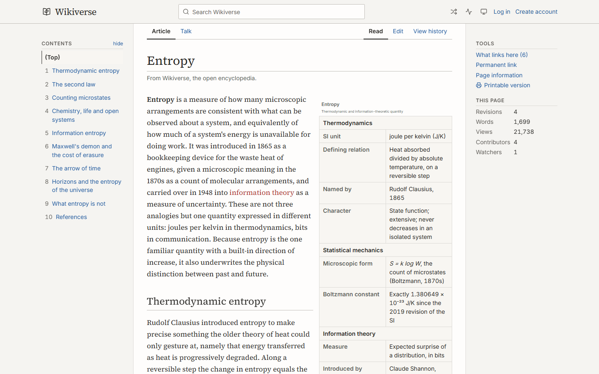
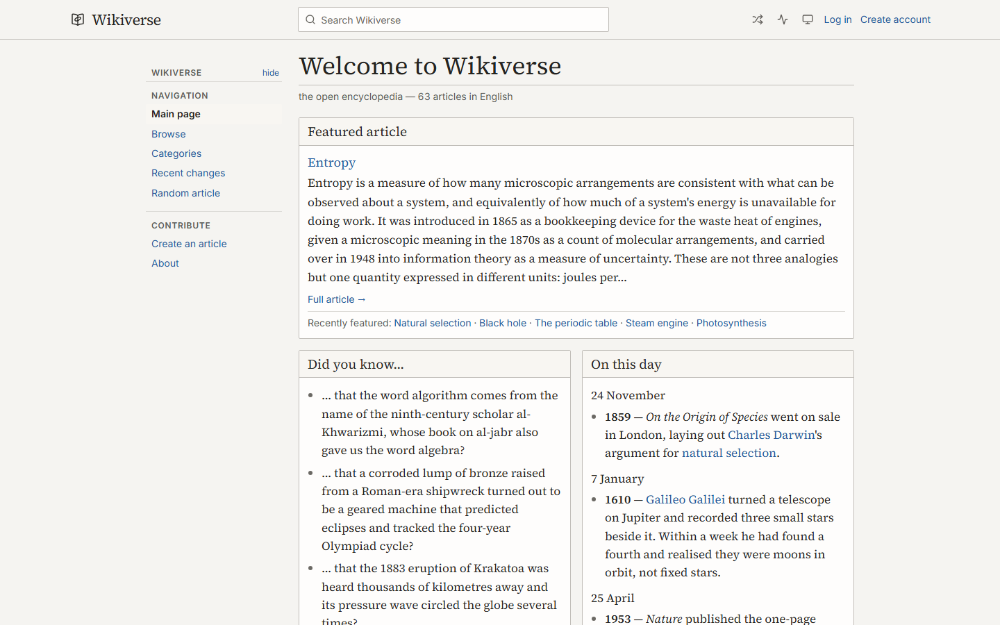
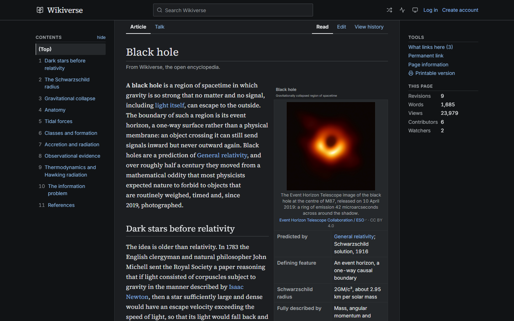
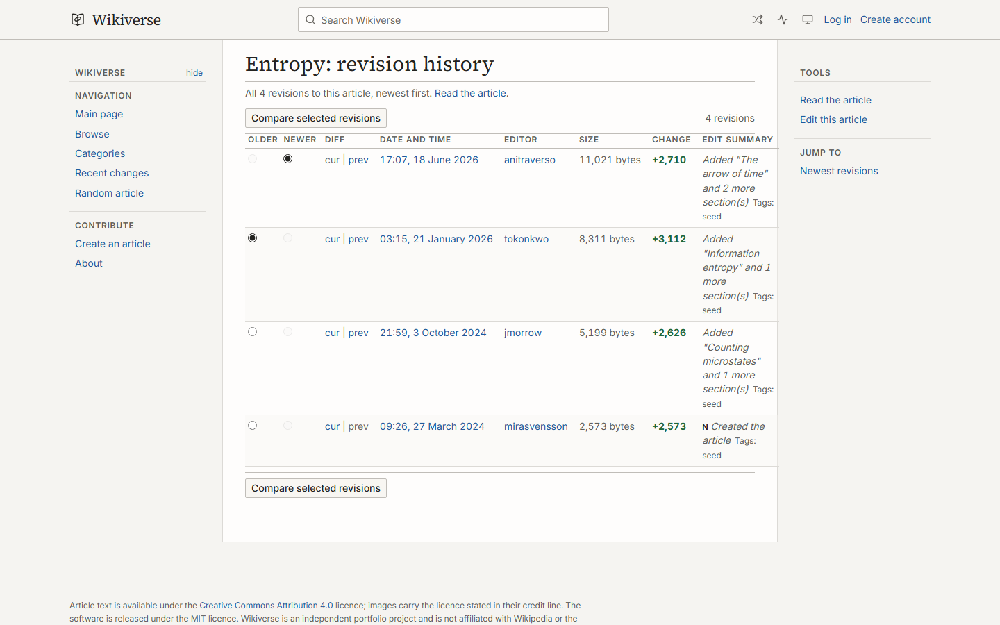
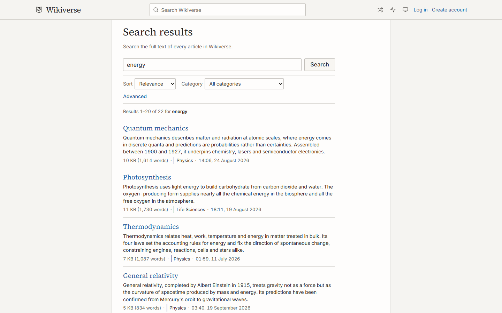
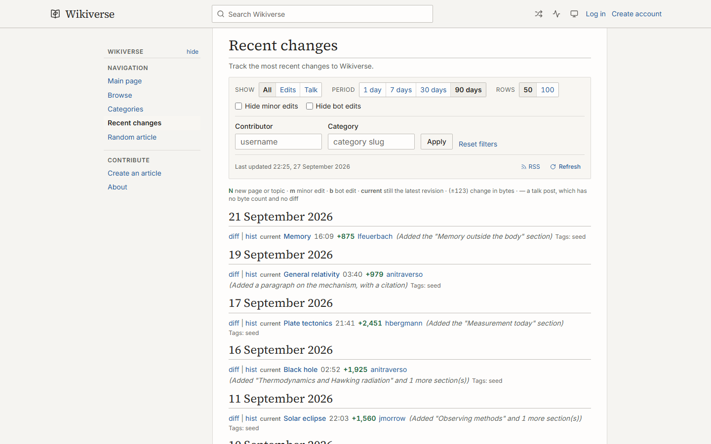
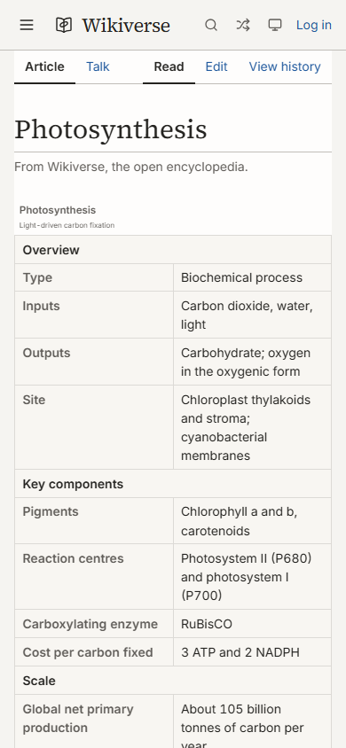
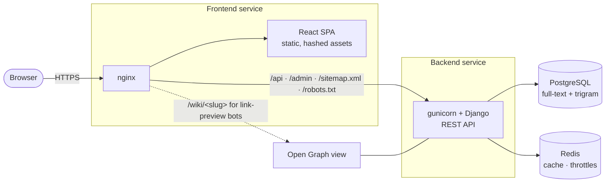

<div align="center">

<picture>
  <source media="(prefers-color-scheme: dark)" srcset="docs/assets/logo-dark.svg">
  
</picture>

### An open encyclopedia, built from scratch

Revision history, word-level diffs, talk pages, watchlists, citations, red links and
PostgreSQL full-text search — the machinery of a real wiki, without MediaWiki.

[**Live site**](https://wikiverse.jonasjavier.dev) ·
[API reference](https://wikiverse.jonasjavier.dev/api/docs/) ·
[Architecture](docs/ARCHITECTURE.md) ·
[Design decisions](docs/DECISIONS.md)

[](https://github.com/JonasJavier/wikiverse/actions/workflows/ci.yml)
[](https://wikiverse.jonasjavier.dev)


[](LICENSE)
[](https://creativecommons.org/licenses/by/4.0/)

<br>



</div>

---

## Contents

- [Overview](#overview)
- [Features](#features)
- [Screenshots](#screenshots)
- [Tech stack](#tech-stack)
- [Architecture](#architecture)
- [Getting started](#getting-started)
- [Testing and quality](#testing-and-quality)
- [API](#api)
- [Project structure](#project-structure)
- [Documentation](#documentation)
- [Roadmap](#roadmap)
- [Contributing](#contributing)
- [License and acknowledgements](#license-and-acknowledgements)

## Overview

Wikiverse began as the wiki assignment of Harvard's *CS50's Web Programming with Python and
JavaScript* and was rebuilt into a production application. It models what makes a wiki a wiki:
every save is an immutable revision, any two revisions can be compared word by word, every
article has a talk page, and a link to an article nobody has written yet shows up red and opens
the editor with the title already filled in.

It ships with a hand-checked general encyclopedia that is live today:

| 63 articles | ~75,000 words | 428 references | 338 revisions | 134 red links | 16 categories |
| :---: | :---: | :---: | :---: | :---: | :---: |

Every article carries an infobox, citations to published sources and a synthesised edit history.
The 57 planned articles that are not written yet are the red links — exactly as on Wikipedia.

## Features

<table>
<tr>
<td width="50%" valign="top">

### 📖 Reading
- Reference-work layout: lead section, **infobox**, lead image with licence credit, *See also*
  and a category bar
- **Numbered footnotes** that link both ways, and a formatted reference list
- **Hover previews** on every wikilink; **red links** for unwritten articles
- Sticky table of contents with scroll-spy, a Tools rail and a print stylesheet
- Main page with a featured article, *Did you know…* and *On this day*

</td>
<td width="50%" valign="top">

### ✍️ Editing and history
- Markdown editor with live preview and a structured **infobox editor**
- **Reference editor** that flags dangling and unused citations
- Drafts saved locally and offered back, never restored silently
- **Revision history** with byte deltas, minor/bot flags and edit summaries
- **Word-level diffs** between any two revisions, side by side or inline
- Page protection, soft delete with staff-only restore, revert endpoint

</td>
</tr>
<tr>
<td width="50%" valign="top">

### 💬 Community
- **Talk pages** with threads and nested replies
- **Recent changes**: edits and talk posts in one feed, filterable by type, contributor,
  category, period, minor and bot edits — every filter lives in the URL
- **RSS feed** of recent changes
- **Watchlists** and per-user contribution histories

</td>
<td width="50%" valign="top">

### 🔎 Search and discovery
- **PostgreSQL full-text search** with weighted ranking and highlighted snippets
- **Typeahead** with trigram typo tolerance and *did you mean* suggestions
- Category and date filters, relevance / newest / oldest sorting
- `sitemap.xml`, `robots.txt`, canonical URLs and per-page metadata
- **Per-article Open Graph cards** on a client-rendered SPA

</td>
</tr>
<tr>
<td colspan="2" valign="top">

### 🔒 Security by construction
No user content ever reaches the DOM as HTML — there is no `dangerouslySetInnerHTML` anywhere, and
a test fails the build if one appears. A strict **Content Security Policy** is emitted by both
nginx and Django, fonts are self-hosted, remote images are allowlisted, JWT refresh tokens rotate
and are revocable, and login throttles cannot be reset by spoofing `X-Forwarded-For`.
See [SECURITY.md](SECURITY.md).

</td>
</tr>
</table>

## Screenshots

<table>
  <tr>
    <td width="50%"></td>
    <td width="50%"></td>
  </tr>
  <tr>
    <td align="center"><sub>Main page</sub></td>
    <td align="center"><sub>Article in the dark theme</sub></td>
  </tr>
  <tr>
    <td></td>
    <td></td>
  </tr>
  <tr>
    <td align="center"><sub>Revision history</sub></td>
    <td align="center"><sub>Full-text search</sub></td>
  </tr>
  <tr>
    <td></td>
    <td align="center"></td>
  </tr>
  <tr>
    <td align="center"><sub>Recent changes</sub></td>
    <td align="center"><sub>Phone layout</sub></td>
  </tr>
</table>

## Tech stack

| Layer | Technology |
| --- | --- |
| **API** | Python 3.13, Django 5.2, Django REST Framework, SimpleJWT, drf-spectacular (OpenAPI 3) |
| **Data** | PostgreSQL 16+ (`tsvector` + GIN, `pg_trgm`, `unaccent`), Redis 7 for cache and throttling |
| **Interface** | React 19, TypeScript, Vite 6, Tailwind CSS v4, TanStack Query, React Router 7, Zustand |
| **Content** | `react-markdown` + GFM with a custom remark plugin for wikilinks, footnotes and red links |
| **Testing** | pytest + pytest-django, Vitest + Testing Library, Playwright |
| **Quality** | Ruff, ESLint (zero warnings), strict TypeScript, OpenAPI schema check, GitHub Actions |
| **Delivery** | Docker, nginx, gunicorn, WhiteNoise, Railway |

## Architecture



A few decisions that shape the codebase — each is explained in
[docs/ARCHITECTURE.md](docs/ARCHITECTURE.md) and fixed as a contract in
[docs/DECISIONS.md](docs/DECISIONS.md):

- **The search vector is maintained by a PostgreSQL trigger**, weighted across title,
  description and body, so no code path can forget to update it. SQLite gets a substring
  fallback chosen at runtime, so development needs no database server.
- **Diffs are computed on the server in two stages** — lines, then words inside changed lines —
  300× to 560× faster than a single word-level pass. One opcode stream feeds the diff page and
  the byte deltas in every feed.
- **The seed is deterministic.** Edit histories derive from a hash of each title, so seeding twice
  produces identical data.
- **Social cards without server-side rendering.** nginx routes only link-preview bots to a Django
  view that renders Open Graph and JSON-LD; people and search engines get the SPA.

## Getting started

### With Docker (recommended)

```bash
git clone https://github.com/JonasJavier/wikiverse.git
cd wikiverse
docker compose up --build
```

This starts PostgreSQL, Redis, the API with hot reload and the Vite dev server, applies the
migrations and seeds the encyclopedia.

| Service | URL |
| --- | --- |
| Encyclopedia | http://localhost:5173 |
| REST API | http://localhost:8000/api/ |
| Interactive API docs | http://localhost:8000/api/docs/ |
| Django admin | http://localhost:8000/admin/ — create the account with `python manage.py ensure_admin` |

If a port is already taken, set `POSTGRES_PORT`, `REDIS_PORT`, `BACKEND_PORT` or `FRONTEND_PORT`
in `.env` (copy `.env.example`). A production-like stack behind nginx runs with
`docker compose -f docker-compose.prod.yml up --build -d`.

### Without Docker

```bash
# Backend — SQLite by default
cd backend
python -m venv .venv && source .venv/bin/activate   # Windows: .venv\Scripts\activate
pip install -r requirements-dev.txt
python manage.py migrate && python manage.py seed
DEBUG=true python manage.py runserver

# Frontend, in a second terminal
cd frontend
npm ci && npm run dev
```

Everything else — PostgreSQL setup, environment variables and the management commands — is in
[docs/DEVELOPMENT.md](docs/DEVELOPMENT.md).

## Testing and quality

| Suite | Tool | Tests | What it covers |
| --- | --- | ---: | --- |
| Backend | pytest | 333 | API contract, permissions, security headers, search, diff engine, talk, SEO, seed determinism |
| Frontend unit | Vitest + Testing Library | 258 | Markdown pipeline, snippet safety, URL contracts, editor payloads, renderers |
| End-to-end | Playwright | 17 | Reading, hover previews, search, history and diff, registration, editing, talk, mobile |

CI runs every gate below on each pull request, with the backend suite on PostgreSQL:

```bash
# Backend
cd backend
ruff check . && ruff format --check .
python manage.py makemigrations --check --dry-run
python manage.py spectacular --fail-on-warn --file schema.yml
python manage.py seed --check
pytest -q

# Frontend
cd frontend
npx tsc -b
npm run lint            # zero warnings allowed
npm test
npm run build
npm run test:e2e        # starts its own backend and production build
```

## API

Thirty-six endpoints, all described by an OpenAPI schema that builds with no warnings.
Browse them at [`/api/docs/`](https://wikiverse.jonasjavier.dev/api/docs/). The most used:

| Method | Endpoint | Purpose |
| --- | --- | --- |
| `GET` | `/api/articles/{slug}/` | Article with infobox, references, categories and link targets |
| `GET` | `/api/articles/{slug}/revisions/` | Revision history |
| `GET` | `/api/articles/{slug}/diff/?from=&to=` | Word-level diff between two revisions |
| `GET` | `/api/articles/{slug}/backlinks/` | What links here |
| `GET` `POST` | `/api/articles/{slug}/talk/` | Talk threads |
| `GET` | `/api/search/?q=` | Full-text search with snippets |
| `GET` | `/api/search/suggest/?q=` | Typeahead |
| `GET` | `/api/changes/` | Recent changes (also as RSS at `/api/feeds/changes.rss`) |
| `GET` | `/api/watchlist/` | The signed-in user's watchlist |
| `GET` | `/api/main-page/` | Featured article, *Did you know*, *On this day*, statistics |
| `POST` | `/api/auth/register/` · `login/` · `refresh/` · `logout/` | JWT authentication with rotation and revocation |

## Project structure

```
wikiverse/
├── backend/
│   ├── apps/
│   │   ├── accounts/        custom user, JWT auth, profiles
│   │   ├── articles/        models, API, search, diff engine, markup parser, seed corpus
│   │   └── common/          security middleware, SEO views, sitemaps, throttling
│   └── config/              12-factor settings, URL configuration
├── frontend/
│   ├── src/
│   │   ├── pages/           one component per route
│   │   ├── components/      article apparatus, history and diff, community, editor, layout, UI
│   │   ├── api/             TanStack Query hooks, one module per domain
│   │   └── lib/ · store/    API client, types, utilities, auth and theme state
│   ├── e2e/                 Playwright journeys
│   └── nginx.conf.template  SPA, reverse proxy and crawler routing
├── docs/                    architecture, decisions, development and deployment guides
├── docker-compose.yml       development stack with hot reload
└── docker-compose.prod.yml  production-like stack behind nginx
```

## Documentation

| Document | What it covers |
| --- | --- |
| [Architecture](docs/ARCHITECTURE.md) | How the system fits together: data model, search, diffs, rendering, security |
| [Design decisions](docs/DECISIONS.md) | The normative contract between the API and the interface |
| [Development](docs/DEVELOPMENT.md) | Running without Docker, management commands, tests |
| [Deployment](docs/DEPLOYMENT.md) | Railway topology, configuration, releasing and seeding |
| [Security](SECURITY.md) | Threat model, what is defended and how to report a vulnerability |
| [Contributing](CONTRIBUTING.md) | Quality gates, non-negotiable rules, writing articles |
| [Changelog](CHANGELOG.md) | What changed between versions |

## Roadmap

- [ ] Write the 57 planned articles that are still red links ([content plan](docs/content-plan.json))
- [ ] Serve lead images as Wikimedia Commons thumbnails instead of full-resolution originals
- [ ] Strip Markdown syntax from search snippets
- [ ] Restrict full page protection to staff on article creation
- [ ] Error reporting with Sentry in production (already wired, off without a DSN)

## Contributing

Contributions are welcome — see [CONTRIBUTING.md](CONTRIBUTING.md) for the quality gates and the
rules that are not negotiable. Writing one of the planned articles is a self-contained first
contribution. Please report security issues privately as described in [SECURITY.md](SECURITY.md).

## License and acknowledgements

- **Code:** [MIT](LICENSE) © Jonas Javier Encarnacion.
- **Article text** of the seed corpus: [CC BY 4.0](https://creativecommons.org/licenses/by/4.0/).
- **Images:** Wikimedia Commons, under the licence named in each credit line.
- **Typefaces:** Source Serif 4, Inter and IBM Plex Mono, under the SIL Open Font License.
- Originally built for Harvard's [CS50W](https://cs50.harvard.edu/web/).

Wikiverse is an independent project and is not affiliated with Wikipedia or the Wikimedia
Foundation.
