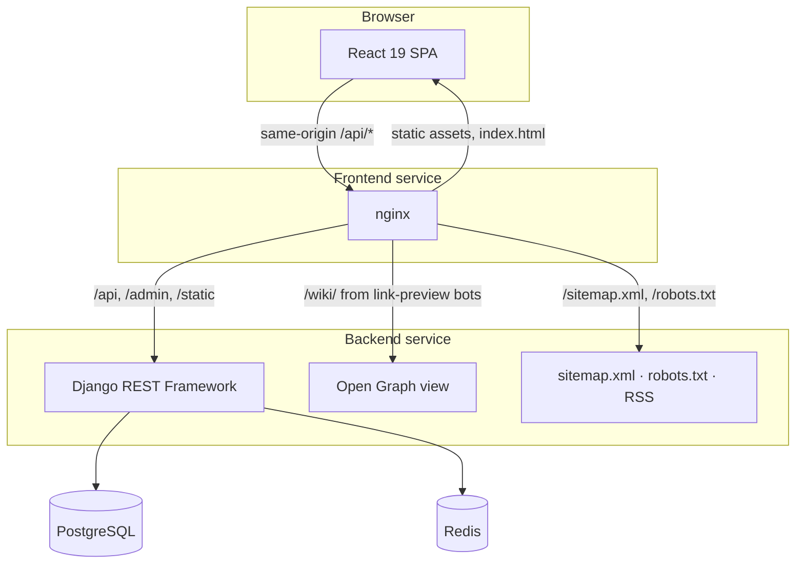
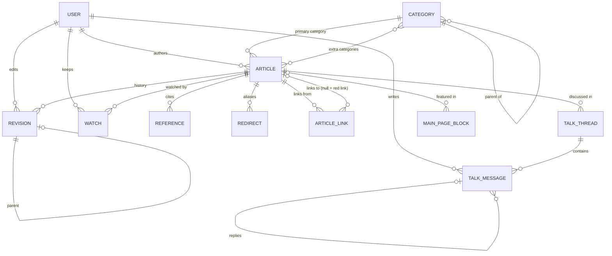
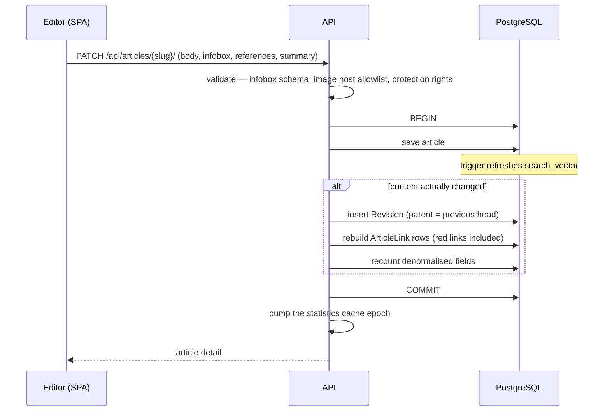

# Architecture

This document explains how Wikiverse fits together and why it is built the way it is. The exact
field names, URL paths and string formats that the API and the interface agree on are the
contract in [DECISIONS.md](DECISIONS.md); this page is the map.

- [System overview](#system-overview)
- [Data model](#data-model)
- [The edit lifecycle](#the-edit-lifecycle)
- [Search](#search)
- [Diffs](#diffs)
- [Rendering articles](#rendering-articles)
- [The frontend](#the-frontend)
- [Security model](#security-model)
- [Caching](#caching)
- [Seed corpus](#seed-corpus)

## System overview

Two deployable services and two managed stores:

- **Frontend** — nginx serves the Vite build and reverse-proxies the API, so the browser talks to
  a single origin. That keeps CORS out of the picture and lets the Content Security Policy say
  `connect-src 'self'`.
- **Backend** — gunicorn running Django. It is also reachable on its own hostname, which is why
  it emits the same security headers as nginx rather than relying on the proxy.
- **PostgreSQL** holds everything, including the full-text index. **Redis** holds caches and
  rate-limit counters; losing it costs performance, never data.

The backend is 12-factor: every setting comes from the environment with a safe default, and the
same code runs on SQLite for development and on PostgreSQL in production. Features that only
PostgreSQL has are chosen **at call time** with `connection.vendor`, never at import time.

## Data model

| Model | Role |
| --- | --- |
| `Article` | The current state of a page: Markdown body, infobox (JSON, schema-validated), lead image, protection level, stored `search_vector`, denormalised counts. Soft-deleted, never removed. |
| `Revision` | An immutable snapshot of the body and metadata after each save, with its parent, editor, summary, byte size and delta, minor/bot flags and tags. |
| `Reference` | One citation, addressed from the body by `[^key]`. Replaced as a set on each save. |
| `ArticleLink` | The wikilink graph, rebuilt from the body on every save. A link whose target does not exist has `to_article = NULL` and keeps `to_title` — a **red link** that turns blue by itself the day the article is written. |
| `Redirect` | An alias title pointing at an article. |
| `TalkThread` / `TalkMessage` | Discussion, with nested replies. Threads denormalise message count, participant count and last activity. |
| `Watch` | A user watching an article. |
| `MainPageBlock` | Editorial content for the main page: featured article, *Did you know*, *On this day*. |
| `Category` | A tree of categories; articles have one primary and any number of extra categories. |

## The edit lifecycle

A save that changes nothing creates no revision: the view fingerprints the article before and
after. Deleting is a soft delete that keeps the history; restoring is staff-only.

## Search

Search has two implementations behind one wire format.

**PostgreSQL** (production):

1. A trigger maintains `search_vector` from the title (weight A), short description and summary
   (weight B) and body (weight C). It fires on changes to any of those columns, so a code path
   cannot forget to update the index — including an edit to the short description alone, which
   is the bug the trigger was written to prevent.
2. Queries use `websearch_to_tsquery` against a dedicated text search configuration,
   `wikiverse_english`, created by migration with `unaccent` when available.
3. Results are ranked with `ts_rank`. When the strict query finds nothing, a `pg_trgm`
   similarity pass retries, and `did_you_mean` offers the closest title.
4. Snippets come from `ts_headline` with **control characters** as delimiters. The result is
   HTML-escaped first and only then are the delimiters swapped for `<mark>` tokens, so
   highlighting can never inject markup.

**SQLite** (development and tests): case-insensitive substring matching over the same fields,
scored by which field matched. The response shape is identical; only relevance differs.

The typeahead (`/api/search/suggest/`) returns at most ten titles — prefix matches first, then
trigram matches — and is cached briefly in Redis.

## Diffs

`apps/articles/diff.py` is deliberately free of Django so it can be tested in isolation.
A single word-level `SequenceMatcher` over a whole article degrades toward quadratic time on
prose (a 120 KB body took ~43 s). The engine therefore works in two stages:

1. **Lines** — diff the two bodies line by line.
2. **Words** — only inside the lines that changed, tokenise with `\w+|\s+|[^\w\s]` and diff the
   tokens.

That is 300× to 560× faster on real articles. The tokenizer is lossless — joining every token
reproduces the source byte for byte, which a test asserts — and safety valves truncate
pathological inputs instead of timing out. Diffs between two historical revisions never
change, so they are cached indefinitely. The same opcode stream produces the byte deltas shown in
history, recent changes, watchlists and contributions.

## Rendering articles

Article bodies are Markdown with two wiki extensions, `[[Title]]` / `[[Title|text]]` wikilinks
and `[^key]` footnote markers. They render through `react-markdown` with GitHub-flavoured
Markdown and a custom remark plugin that:

- resolves wikilinks against the article's link rows, marking missing targets as red links
  that point at `/new?title=<Title>`;
- numbers footnotes in order of first use and generates `cite_note-{key}` / `cite_ref-{key}-{n}`
  anchors, so references link both ways;
- derives heading ids with the same unicode-aware slugifier the table of contents uses, so the
  two can never disagree.

Raw HTML is **never** rendered: `skipHtml` is always on and `rehype-raw` is never loaded. The
same pipeline renders talk messages, infobox values and reference titles.

## The frontend

- **Routing** — React Router 7 with route-level code splitting. The main page, the article page
  and the not-found page are in the entry chunk; everything else, the editor above all, loads
  on first visit.
- **Data** — TanStack Query, one module per domain under `src/api/`, with query keys shaped per
  domain so writes invalidate exactly what they affect. Retries happen only for network errors
  and 5xx responses.
- **State** — Zustand for the session (tokens in storage, `isAuthenticated` derived rather than
  persisted, synchronised across tabs) and the theme (light, dark or system).
- **Layout** — a three-column frame whose maximum width is the sum of the columns a page
  actually uses: site navigation or the table of contents on the left, the reading column,
  and the Tools rail on the right. Below 960px the rails move into the masthead and a
  disclosure at the foot of the article.
- **Design system** — Tailwind CSS v4 configured entirely in `src/index.css` as design tokens,
  in light and dark themes designed against WCAG AA contrast ratios. Self-hosted Source Serif 4, Inter and
  IBM Plex Mono.
- **URL as state** — search, recent changes and category listings keep every filter in the URL,
  so any view can be shared, bookmarked and restored with the back button.

## Security model

| Concern | Defence |
| --- | --- |
| Script injection through content | No `dangerouslySetInnerHTML`; `skipHtml` Markdown; escaped search snippets. A test fails the build on any regression. |
| Script injection through the page | Strict CSP from nginx **and** Django: `script-src 'self'`, no inline scripts (the pre-paint theme script is a static file), `frame-ancestors 'none'`. |
| Third-party requests | Fonts are self-hosted; remote images are limited to Wikimedia hosts, validated server-side and enforced by `img-src`. |
| Stolen tokens | 30-minute access tokens; 2-day refresh tokens that rotate and are blacklisted on use and on logout. |
| Credential stuffing | Login and registration throttles keyed on the submitted username as well as the address, so a forged `X-Forwarded-For` does not reset them. |
| Vandalism | Every edit is an attributed, immutable revision; protection levels; soft delete with staff-only restore. |
| Secrets | Environment only. The seed never creates a superuser; `ensure_admin` does, from environment variables. |

Nine throttle scopes — anonymous, user, search, suggest, preview, diff, write, login and
register — are all adjustable through environment variables.

## Caching

| What | Where | Invalidation |
| --- | --- | --- |
| Site statistics | Redis | An epoch counter bumped on every write |
| Main page payload | Redis | Time-based |
| Typeahead suggestions | Redis | `SEARCH_SUGGEST_TTL` seconds |
| Diffs between historical revisions | Redis | Never — they are immutable |
| Hashed JS, CSS and fonts | Browser | Never — file names change with content |
| `index.html` | Nowhere | `no-cache`, so a deploy reaches every reader immediately |

## Seed corpus

The encyclopedia lives in `backend/apps/articles/management/commands/_seed_data/`, one Python
module per subject area, each exporting a list of articles in the shape defined in
[DECISIONS.md §19](DECISIONS.md). `manage.py seed` validates the whole corpus against 31 rules —
dangling footnotes, infoboxes that break the schema, links outside the content plan, unused
references — before writing anything.

Edit histories are synthesised: each article gets two to nine revisions whose timestamps and
authors derive from a hash of its title, so seeding twice produces identical data. `--epoch`
moves the whole history to end on a given day.

The corpus text is licensed CC BY 4.0, separately from the MIT-licensed code.
